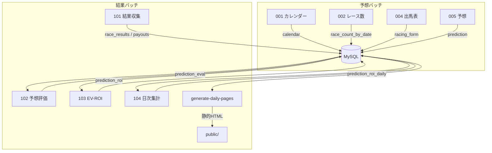

# けんちゃん☆馬券 ver2.0 — 地方競馬（サラ系）

NAR（地方競馬全国協会）の情報を収集・蓄積し、レース予想や結果分析を行うための基盤システムです。  
設計思想として「疎結合」を採用しており、各工程（開催日取得・出馬表取得・予想・結果収集・集計）が独立したスクリプトとして動作します。

---

## 🧠 Design Notes（設計思想）

日次バッチは以下の3つに分離し、それぞれ**日付指定で実行可能**です。  
同じ日を何度呼び出しても**同一結果になる（冪等性）**ことを前提にしています。

1. **デイリー予想バッチ**  
   指定日の開催情報取得 → 出馬表保存 → 予想作成までを一括実行。
2. **デイリー結果・集計バッチ**  
   結果取得 → 予想評価 → ROI集計 → Webページ生成までを一括実行。
3. **Webページ生成スクリプト**  
   指定日のデータから静的HTMLを生成（単体実行も可能）。

> データが存在しない日はWebページを生成しない。  
> 予想はあるが結果がない場合は、予想データまでを生成する。

---

## 📁 Directory Layout

| ディレクトリ | 役割 |
| :--- | :--- |
| `config/` | DB接続設定 (`config.js`) |
| `data/` | スキーマ、シード、初期化スクリプト |
| `docs/` | 仕様・コード表ドキュメント |
| `scripts/` | Node.js 実行スクリプト群 |
| `scripts/ops/` | バッチ/シェル運用スクリプト群 |
| `public/` | Web公開用 静的ファイル出力先 |

---

## 🚀 Cheat Sheet（日次運用）

### 予想バッチ
```bash
node scripts/daily-yosou-batch.js           # 本日分
node scripts/daily-yosou-batch.js 20260523  # 指定日
```

### 結果・集計バッチ
```bash
node scripts/daily-result-batch.js           # 本日分
node scripts/daily-result-batch.js 20260523  # 指定日
```
内部処理順: `003 → 101 → 102 → 103 → 104 → generate-daily-pages`

### Webページ生成（単体）
```bash
node scripts/generate-daily-pages.js 20260523
```
生成結果は `public/` と `public/daily/YYYYMMDD/` に出力され、  
`config.htmlRetentionDays`（既定 30日）より古いファイルは自動削除されます。

### 騎手・種牡馬ランキング（月1回手動）
```bash
bash scripts/ops/monthly-fetch-jockey-ranking.sh
bash scripts/ops/monthly-fetch-sire-ranking.sh
```

### ローカルプレビュー
```bash
npm run serve   # http://localhost:8131
```

---

## 🧩 Component Reference

### 予想フェーズ

| スクリプト | 引数 | 出力 | 役割 |
| :--- | :--- | :--- | :--- |
| `daily-yosou-batch.js` | `[YYYYMMDD]` | — | **【メイン】** 予想処理を一括実行するラッパー |
| `001-save-monthly-calendar.js` | `YYYYMMDD` | `calendar` | 月間開催スケジュール取得 |
| `002-save-race-count-by-date.js` | `YYYYMMDD` | `race_count_by_date` | 各会場のレース数取得 |
| `003-list-race-ids.js` | `YYYYMMDD` | stdout | 全レースID（12桁）をリスト出力 |
| `004-racing-form-to-db.js` | `YYYYMMDDRRBB` | `racing_form` | 出馬表を取得・保存（Selenium使用） |
| `005-predict-race.js` | `YYYYMMDDRRBB` | `prediction` | AI予想を計算・保存 |

### 結果・集計フェーズ

| スクリプト | 引数 | 出力 | 役割 |
| :--- | :--- | :--- | :--- |
| `daily-result-batch.js` | `[YYYYMMDD]` | — | **【メイン】** 結果収集〜HTML生成を一括実行するラッパー |
| `101-save-result-db.js` | `YYYYMMDDRRBB` | `race_results`, `race_payouts` | 楽天競馬から結果・払戻を取得・保存 |
| `102-eval-prediction.js` | `YYYYMMDDRRBB` | `prediction_eval` | 予想の的中有無を判定・保存 |
| `103-eval-roi.js` | `--from` `--to` | `prediction_roi` | EV基準でROIをシミュレーション・保存 |
| `104-aggregate-roi-daily.js` | `YYYYMMDD` | `prediction_roi_daily` | 日次ROIを集計・保存 |
| `generate-daily-pages.js` | `[YYYYMMDD]` | `public/` | 静的HTMLを生成 |

---

## 🔁 Data Flow



---

## ✅ Prerequisites（動作要件）

- **Node.js v22.x (LTS)**
- **MySQL 8.x**
- **Google Chrome**（Selenium使用のため）

---

## 🛠 Setup（初期セットアップ）

### 1. リポジトリのクローン
```bash
git clone <repository-url>
cd localvenue
npm install
```

### 2. MySQL インストール＆DB作成
```bash
bash create-database.sh
```
スクリプト内の `DB_PASS` を任意のパスワードに変更してから実行してください。

### 3. アプリ設定
```bash
cp config/config.sample.js config/config.js
# config/config.js の password を create-database.sh で設定したものに合わせる
```

### 4. スキーマ適用＋マスターデータ投入
```bash
node data/data_reset.js
```

### 5. 動作確認
```bash
node scripts/daily-yosou-batch.js 20260523
node scripts/daily-result-batch.js 20260523
npm run serve   # http://localhost:8131
```

---

## 🌐 静的HTML配信

方針：**バッチ実行環境で `public/` を生成し、公開サーバーは静的ファイル配信のみ**。

公開先のホスト名、ユーザー名、絶対パスなどの運用情報はリポジトリに書かず、各環境の手順書またはシークレット管理に分離してください。

### Nginx 設定例
```nginx
server {
    listen 80;
    server_name example.com;
    root /path/to/localvenue/public;
    index index.html;
    location / { try_files $uri $uri/ =404; }
}
```

### 日次デプロイ例
```bash
rsync -avz --delete ./public/ deploy@example.com:/path/to/public/
```

---

## 🔐 Public Repository Notes（公開リポジトリ向け注意）

- `config/config.js`、`.env*`、DBダンプ、ログ、ローカル実行環境の絶対パス、公開サーバーの具体的な接続情報はコミットしないでください。
- DBダンプは `data/dumps/` 配下に置く場合でもローカル専用です。スキーマ共有には `data/schema.sql` を使ってください。
- ドキュメントには、実ドメイン・メールアドレス・サーバー名・ユーザー名・パスワードを直接書かず、`example.com` や `<repository-url>` のようなプレースホルダーを使ってください。

---

## 🛡️ 脆弱性診断メモ（2026-05-27 簡易診断）

以前実施した外部ブラックボックス簡易診断の要約です。対象URLなど公開運用に紐づく詳細は、公開リポジトリ上では伏せています。

- **重大な露出は未検出**: `.git/HEAD`、`.env`、`phpinfo.php`、`server-status`、`wp-admin/`、`api/` など代表的な漏えいパスは 404 応答。
- **セキュリティヘッダは良好**: `Content-Security-Policy`、`Strict-Transport-Security`、`X-Frame-Options`、`X-Content-Type-Options`、`Referrer-Policy`、`Permissions-Policy` を確認。
- **入力値起点の典型脆弱性は観測されず**: 静的HTML中心の公開面で、簡易的な反射型XSS・SQLi・パストラバーサルの混入は確認されませんでした。
- **HTTPメソッド**: `OPTIONS` 応答で `OPTIONS, HEAD, GET, POST` が許可されていました。静的配信のみなら、不要な `POST` を閉じる運用を検討してください。
- **推奨アクション**: アクセスログ監視、`/.well-known/security.txt` の設置、不要HTTPメソッドの最小化、月次のヘッダ・露出ファイル・依存更新チェック。

> 注意: この診断は非破壊・外部からの限定的な簡易確認です。サーバー内部設定、認証領域、CI/CD、依存ライブラリ、クラウド権限などは別途確認してください。

---

## 🔄 スキーマ更新

DBから最新スキーマをダンプする場合:
```bash
bash scripts/ops/gen-schema.sh
```
