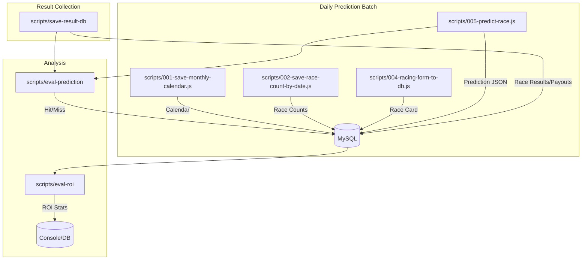

# LocalVenue — 地方競馬（サラ系）開催情報スクレイパ & API

NAR（地方競馬全国協会）の情報を収集・蓄積し、レース予想や結果分析を行うための基盤システムです。
設計思想として「疎結合」を採用しており、各工程（開催日取得、出馬表取得、予想、結果収集、集計）が独立したスクリプトとして動作します。

---

## 🧠 Design Notes (重要な設計思想)

日次バッチは以下の3つに分離し、それぞれ**日付指定で実行可能**とします。  
同じ日を何度呼び出しても**同一結果になる（冪等性）**ことを前提にしています。

1. **デイリー予想バッチ**  
   指定日の開催情報取得 → 出馬表保存 → 予想作成までを行う。
2. **デイリー結果・予想集計バッチ**（未実装だが作成可能）  
   指定日のレース結果と予想結果を集計する。
3. **デイリーWebページ生成バッチ**（未実装）  
   指定日のデータからWebページを生成する。

### 生成ルール

- データが存在しない日はWebページを**生成しない**。
- 予想はあるが結果がない場合は、**予想データまで**を生成する。

---

## 📁 Directory Layout

| ディレクトリ | 役割 |
| :--- | :--- |
| `config/` | DB接続設定 (`config.js`) の管理場所 |
| `data/` | スキーマ、シード、HTMLダンプ等の保管 |
| `docs/` | 仕様やコード表のドキュメント |
| `scripts/` | Node.js 実行スクリプト群 |
| `scripts/ops/` | バッチ/シェル運用スクリプト群 |
| `tests/` | 動作確認・検証用スクリプト |
| `lib/` | 共通ユーティリティ |
| `public/` | Web公開用ファイル |

---

## 🚀 Cheat Sheet (作業再開用)

久しぶりに作業するときは、まずここを見てください。
基本的な日次運用フローは以下の通りです。

### 1. 予想バッチ (Daily Prediction)
指定日の予想を実行します（開催情報収集、出馬表保存、予想計算を一括実行）。
```bash
# 本日分を実行
node scripts/daily-yosou-batch.js

# 指定日を実行 (例: 2025年10月13日)
node scripts/daily-yosou-batch.js 20251013
```

### 2. 結果収集 (Daily Result Collection)
⚠ **注意**: 日次一括収集スクリプト (`daily-save-race-results.js`) は現在リポジトリに見当たりません。
単発で収集する場合は以下を使用します。
```bash
# 指定レースの結果収集 (YYYYMMDDRRBB)
node scripts/save-result-db.js 202510130101
```

### 3. Webページ生成 (Web Generation)
指定日の静的HTML・CSSファイルを `public/` ディレクトリに生成します。
```bash
# 指定日のページを生成
node scripts/generate-daily-pages.js 20260201
```

### 4. プレビュー用サーバーの起動 (Live Preview)
Apacheなしでも、Node.jsのみで生成結果を確認できます。

```bash
# http://localhost:8131 で起動
npm run serve
```

---

## 🧩 Component Reference (プログラム一覧)

どのスクリプトに何を渡すとどうなるかのリファレンスです。

### 🔮 Prediction Phase (予想フェーズ)

| スクリプト名 | 入力 (引数) | 出力 (DB) | 役割 |
| :--- | :--- | :--- | :--- |
| **`scripts/daily-yosou-batch.js`** | `[YYYYMMDD]` (省略時は当日) | (一連のテーブル) | **【メイン】** 以下の収集・予想処理を一括で行うラッパーです。 |
| `scripts/001-save-monthly-calendar.js` | `YYYY MM` | `calendar` | 指定月の開催スケジュールを取得します。 |
| `scripts/002-save-race-count-by-date.js` | `YYYYMMDD` | `race_count` | その日の各会場のレース数を取得します。 |
| `scripts/003-list-race-ids.js` | `YYYYMMDD` | (標準出力) | その日の全レースID (12桁) をリストアップします。 |
| `scripts/004-racing-form-to-db.js` | `YYYYMMDDRRBB` | `race_card` 等 | 指定レースの出馬表を取得・保存します。 |
| `scripts/005-predict-race.js` | `YYYYMMDDRRBB` | `prediction` | モデルを使って予想を作成し、JSON形式で保存します。 |

### 📊 Result & Analysis Phase (結果・集計フェーズ)

| スクリプト名 | 入力 (引数) | 出力 (DB) | 役割 |
| :--- | :--- | :--- | :--- |
| **`scripts/save-result-db.js`** | `YYYYMMDDRRBB` | `race_results`<br>`race_payouts` | 楽天競馬から結果と払戻を取得・保存します。 |
| `scripts/eval-prediction.js` | `YYYYMMDDRRBB` | `prediction_eval` | 予想と結果を突き合わせ、的中有無を判定して保存します。 |
| `scripts/eval-roi.js` | `--from` `--to` 等 | (標準出力)<br>`prediction_roi` | 期間を指定して回収率 (ROI) をシミュレーション・集計します。<br>例: `node scripts/eval-roi.js --from 2025-10-01 --to 2025-10-31` |

---

## 🔁 Data Flow (データフロー)



---

## ⚠️ Missing / Known Issues (確認事項)

以下のスクリプトは旧ドキュメントに記載がありましたが、現在のルートディレクトリに見当たりません。
これらが必要な場合は、バックアップからの復旧や再実装が必要です。

*   `daily-save-race-results.js` (日次で全レース結果を保存するバッチ)
*   `daily-guess.js` (これは `scripts/daily-yosou-batch.js` にリネームされた可能性が高いです)
*   `api-sire-score.js` は参照箇所がないため削除済みです。

---

## ✅ Prerequisites (動作要件)

*   **Node.js v22.20.0 (LTS)**
*   **MySQL 8+**
*   **Google Chrome** (Selenium用)

### Setup
```bash
git clone https://github.com/kenchanbaken/localvenue.git
cd localvenue
npm i
# config/config.sample.js を config/config.js にコピーしてDB設定を記述
cp config/config.sample.js config/config.js
```

### Database Setup (環境構築手順)
初回インストールと再構築の手順は以下の通りです。

#### 1. インストール時（初期化）
`data/data_reset.js` が **schema.sql を適用 → seed-master.sql を投入** まで行います。  
初期化に必要な最低限のマスターデータを入れる場合は、このスクリプトを使ってください。

```bash
# DB接続設定が完了していること（config/config.js）
node data/data_reset.js
```

#### 2. 再構築手順（スキーマ再作成 + 最低限マスターデータのリセット）
既存データを作り直して、最低限のマスターデータに戻したい場合も
`data/data_reset.js` を使います。

```bash
node data/data_reset.js
```

#### 3. schema.sql が最新でない場合の更新
DBから最新スキーマをダンプする場合は以下を実行します。

```bash
./scripts/ops/gen-schema.sh
```

### Web Server (Apache) Setup
WSL上のApacheで閲覧する場合は、以下の設定を行います。ポート **8131** を使用します。

1.  設定ファイル `/etc/apache2/sites-available/localvenue.conf` を作成（既にある場合は修正）:
    ```apache
    <VirtualHost *:8131>
        ServerName localvenue.local
        DocumentRoot /home/ichikabu/projects/localvenue/public
        <Directory /home/ichikabu/projects/localvenue/public>
            Options Indexes FollowSymLinks
            AllowOverride All
            Require all granted
        </Directory>
    </VirtualHost>
    ```
2.  `/etc/apache2/ports.conf` に `Listen 8131` を追加。
3.  サイトを有効化して再起動:
    ```bash
    sudo a2ensite localvenue
    sudo systemctl restart apache2
    ```
